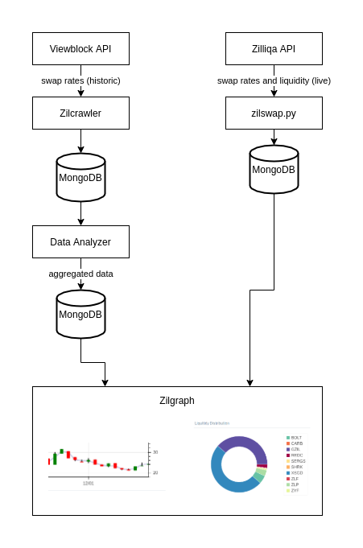
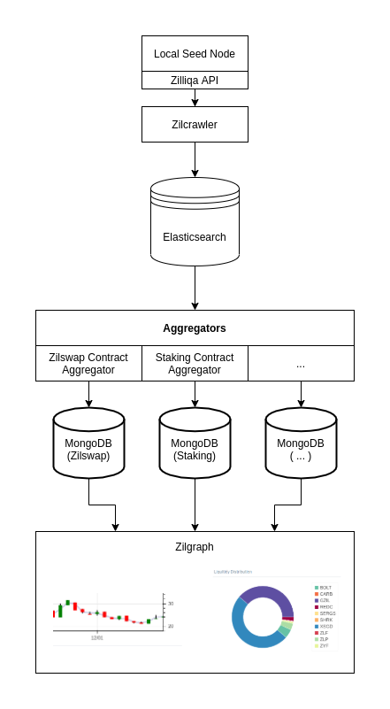
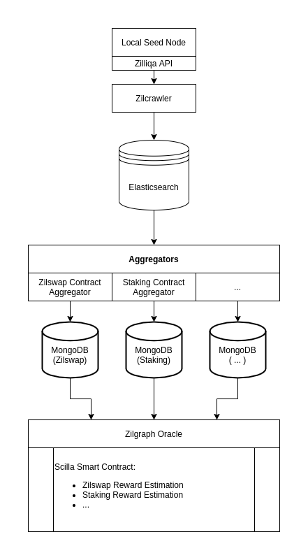

# Zilgraph - Legacy Architecture

This first implementation of Zilgraph is a result of the XSGD hackathon. The architecture was designed in a rush for the Hackathon.

# Zilgraph - Architecture 2.0

In order to allow Zilgraph to scale to the go to place to get insights in all kind of analytics regarding the Zilliqa blockchain, we need to overcome these flaws:

1. ViewblockAPI is nice for doing the job quick, but provides a lot of friction if you want to do solid work. Therefore we need to switch completely to the Zilliqa Seed Node API for acquiring data. Best case, seed node is running locally to avoid unnecessary bandwidth issues.
2. The Zilcrawler basically stores raw json data in the MongoDB, which provides no real benefit if you are running a local seed node anyhow. This should be replaced by a database which allows advanced queries to search in the data, like Elasticsearch.
3. Data aggregators will do advanced queries to Elasticsearch and store aggregated data for quick access in MongoDBs.
3. Zilgraph front end presents aggregated data in a visualized manner.

# Zilgraph Oracle

The Zilgraph Oracle is an early stage idea. The idea is to provide aggregated data back to the Zilliqa blockchain using a Smart Contract Oracle.

